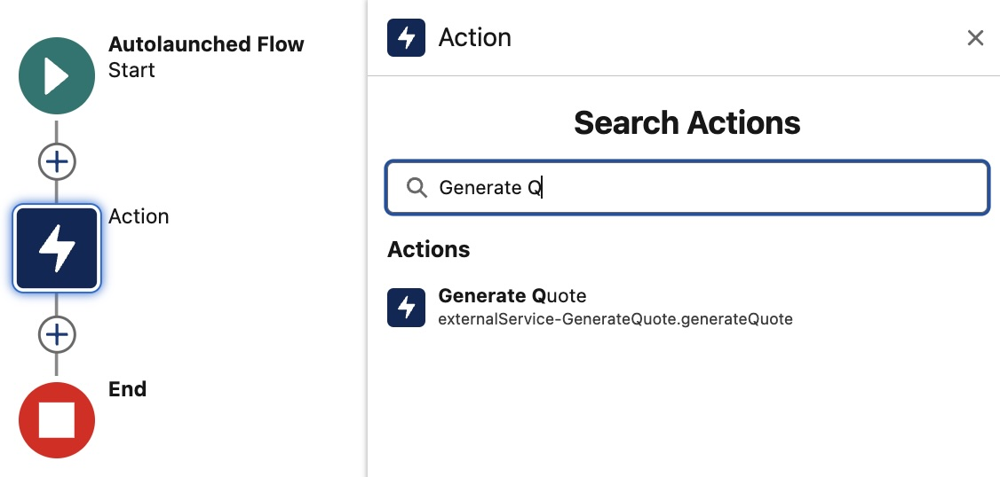
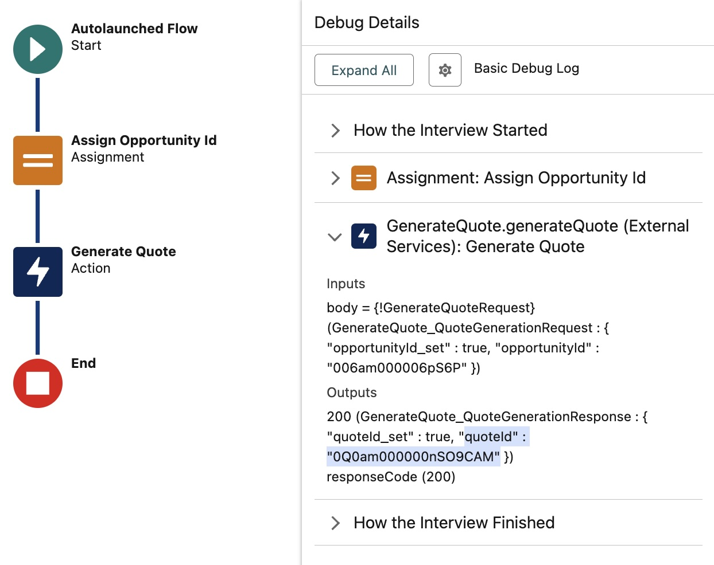

Heroku Integration - Extending Apex, Flow and Agentforce - Java
===============================================================

> [!IMPORTANT]
> For use with the Heroku Integration and Heroku Eventing pilots only

This sample demonstrates importing a Heroku application into an org to enable Apex, Flow, and Agentforce to call out to Heroku. For Apex, both synchronous and asynchronous invocation are demonstrated, along with securely elevating Salesforce permissions for processing that requires additional object or field access.

The scenario used in this sample illustrates a basis for performing complex compute calculations over Salesforce **Opportunity** data and storing the result back in Salesforce as a **Quote**. Calculating Quote information from Opportunities can become quite intensive, especially when large multinational businesses have complex rules that impact pricing related to region, products, and discount thresholds. It's also possible that such code already exists, and there is a desire to reuse it within a Salesforce context.

Requirements
------------
- Heroku login
- Heroku Integration Pilot enabled
- Heroku CLI installed
- Heroku Integration Pilot CLI installed
- Salesforce CLI installed
- Login information for one or more Scratch, Development or Sandbox orgs

## Local Development and Testing

Code invoked from Salesforce requires specific HTTP headers to connect back to the invoking Salesforce org. Using the `invoke.sh` script supplied with this sample, it is possible to simulate requests from Salesforce with the correct headers, enabling you to develop and test locally before deploying to test from Apex, Flow, or Agentforce. This sample leverages the `sf` CLI to allow the `invoke.sh` script to access org authentication details. Run the following commands to locally authenticate, build and run the sample:

```
sf org login web --alias my-org
mvn clean install
mvn spring-boot:run
```

In a new terminal window run the following command substituing `006am000006pS6P` for a valid **Opportunity Id** record from your Salesforce org, ensuring you identify an **Opportunity** that also has related **Product** line items.

```
./bin/invoke.sh my-org 006am000006pS6P
```

You should see the following output:

```
Response from server:
{"quoteId":"0Q0am000000nRLdCAM"}
```

You can now also view the **Quote** by refreshing the **Opportunity** page within Salesforce.

## Deploying and Testing from Apex and Flow

To test from Apex, Flow and other tools within your Salesforce org you must deploy the code and import it into your org. The following commands create a Heroku application and configure the Heroku Integration add-on. This add-on and associated buildpack allows secure authenticated access from within your code and visibility of your code from Apex, Flow and Agentforce. After this configuration, code is not accessible from the public internet, only from within an authorized Salesforce org.

```
heroku create
git push heroku main
```

Next install and configure the Heroku Integration add-on:

```
heroku addons:create heroku-integration
heroku buildpacks:add https://github.com/heroku/heroku-buildpack-heroku-integration-service-mesh
heroku salesforce:connect my-org --store-as-run-as-user
heroku salesforce:import api-docs.yaml --org-name my-org --client-name GenerateQuote
```

Trigger an application rebuild to install the Heroku Integration buildpack

```
git commit --allow-empty -m "empty commit"
git push heroku main
```

Once imported grant permisisons to users to invoke your code using the following `sf` command:

```
sf org assign permset --name GenerateQuote -o my-org
```

Deploy the Heroku application and confirm it has started.

```
git push heroku main
heroku logs
```

Navigate to your orgs **Setup** menu and search for **Heroku** then click **Apps** to confirm your application has been imported.

### Invoking from Apex

Now that you have imported your Heroku application. The following shows an Apex code fragment the demonsrates how invoke it in an synchronous mannor (waits for response). At present this Java sample does not support asynchronous invocation, please consult the Node version for this. Make sure to change the **Opportunity Id** `006am000006pS6P` below to a valid **Opportunity** from your org (see above).

```
echo \
"ExternalService.GenerateQuote service = new ExternalService.GenerateQuote();" \
"ExternalService.GenerateQuote.generateQuote_Request request = new ExternalService.GenerateQuote.generateQuote_Request();" \
"ExternalService.GenerateQuote_QuoteGenerationRequest body = new ExternalService.GenerateQuote_QuoteGenerationRequest();" \
"body.opportunityId = '006am000006pS6P';" \
"request.body = body;" \
"System.debug(service.generateQuote(request).Code200.quoteId);" \
| sf apex run -o my-org
```

Inspect the debug log output sento to the console and you should see the generted Quote ID output as follows:

```
07:56:11.212 (3213672014)|USER_DEBUG|[1]|DEBUG|0Q0am000000nRS5CAM
```

### Invoking from Flow

Salesforce Flow is the primary no code automation tool within Salesforce orgs and is regularly used to automate business tasks related to Accounts, Opportunities, and more. Flow builders, like Apex developers, can also benefit from additional compute power provided through your Heroku applications. There is no additional work required to enable Flow Builder to see your code-simply search for it using the Action element, as shown below.



To test invoking your code from Flow, deploy a simple Flow using the command below:

```
sf project deploy start --source-dir src-org -o my-org
```

Open the Flow called **Generate Quote Test** and click the **Debug** button entering a valid **Opportunity Id**. Once the Flow completes inspect the contents of the output variable and you should see the now familar **Quote Id** present. 



The Flow used here is a very basic Autolaunched Flow, however you can use this approach in other Flow types such as Screen Flows as well - allowing you to build user experiences around your Heroku applications with Flow for example.

## Permissions and Permission Elevation

Authenticated connections passed to your code are created with the user identity of the user that directly or indirectly causes a given Apex, Flow, or Agentforce operation to invoke your code. As such, in contrast to Apex, your code always accesses org data in the more secure User mode (only the permissions granted to the user), not System mode (access to all data). This favors the more secure coding convention of the principle of least privilege. If your code needs to access or manipulate information not visible to the user, you must use the approach described here to elevate permissions.

If you have not done so, run the above command `sf project deploy` to deploy additional metadata to your Salesforce org. In addition to the Flow, this also deployed a new custom field on the `OpportunityLineItem` called `DiscountOveride__c`. A special field that only sales leaders would have access to completly override the discount calculations in the pricing engine if desired. Since its not then the case that all users have access to this field, in order to allow only the code to acccess this field we are going to have elevate its permissions.

First lets understand the behavior of our code without elevated permissions. Create a `.env` file with the following entry and rerun the application locally using `mvn spring-boot:run`.
```
ENABLE_DISCOUNT_OVERRIDES=True
```
Use the `invoke.sh` script to attempt to generate a new *Qoute*. The request will fail with a `500` and you will see in the console log is the following error:

```
No such column 'DiscountOverride__c' on entity 'OpportunityLineItem'. If you are attempting to use a custom field, be sure to append the '__c' after the custom field name. Please reference your WSDL or the describe call for the appropriate names.'
```

## Invoking from Agentforce

bla bla 

## Technical Information
- 

## Other Samples

| Sample | What it covers? |
| ------ | --------------- |
| [Salesforce API Access - Java](https://github.com/heroku-examples/heroku-integration-pattern-api-access-java) | This sample application showcases how to extend a Heroku web application by integrating it with Salesforce APIs, enabling seamless data exchange and automation across multiple connected Salesforce orgs. It also includes a demonstration of the Salesforce Bulk API, which is optimized for handling large data volumes efficiently. |
| [Extending Apex, Flow and Agentforce - Java](https://github.com/heroku-examples/heroku-integration-pattern-org-action-java) | This sample demonstrates importing a Heroku application into an org to enable Apex, Flow, and Agentforce to call out to Heroku. For Apex, both synchronous and asynchronous invocation are demonstrated, along with securely elevating Salesforce permissions for processing that requires additional object or field access. |
| [Scaling Batch Jobs with Heroku - Java](https://github.com/heroku-examples/heroku-integration-pattern-org-job-java) | This sample seamlessly delegates the processing of large amounts of data with significant compute requirements to Heroku Worker processes. It also demonstrates the use of the Unit of Work aspect of the SDK (JavaScript only for the pilot) for easier utilization of the Salesforce Composite APIs. |
| [Using Eventing to drive Automation and Communication](https://github.com/heroku-examples/heroku-integration-pattern-eventing-java) | This sample extends the batch job sample by adding the ability to use eventing to start the work and notify users once it completes using Custom Notifications. These notifications are sent to the user's desktop or mobile device running Salesforce Mobile. Flow is used in this sample to demonstrate how processing can be handed off to low-code tools such as Flow. |
